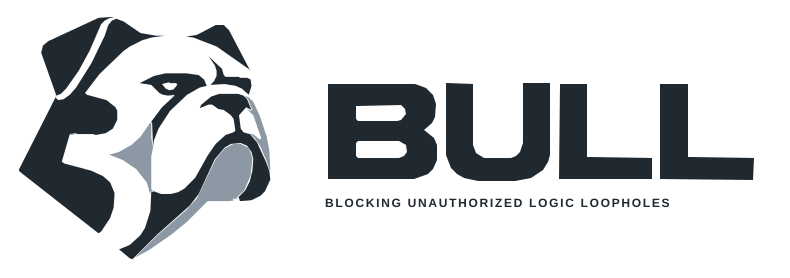

<p align="center"><picture><source media="(prefers-color-scheme: dark)" srcset="site/assets/brand/bull-primary-dark.svg"></picture></p>

# BULL

An experimental, open-source execution firewall for AI agents. The model proposes
an action; trusted host integration supplies authority. BULL checks that authority,
constrains execution, and records an authenticated audit checkpoint.

[Presentation](docs/PRESENTATION.md) · [Evidence](docs/VALIDATION_20260923.md) ·
[Architecture](docs/PRODUCTION_SECURITY.md) · [Contributing](CONTRIBUTING.md)

The software release work and hardware host integration are merged into `main`.
See the [branch integration record](docs/BRANCH_INTEGRATION.md).
The KB2040 is a diagnostic prototype: no secure element is connected, so it
cannot authorize protected actions. See [hardware status](docs/HARDWARE_AUTHORITY.md).

## What it does

```text
untrusted proposal → production dispatcher → policy + exact command binding
                   → constrained execution → authenticated audit receipt
```

BULL mediates explicitly integrated operations. It is not a system-wide interceptor.
The host, kernel, operator, policy storage and enrolled approval channel remain
trusted. Supported execution paths are [listed here](docs/ADAPTER_VALIDATION.md).

Two paths have live evidence: fixed read-only tools in the host Linux namespace
sandbox, and one-shot QEMU/KVM guests. The standalone multiagent package is
host-callable development orchestration, not an automatic production adapter.

## Recorded validation

Full deployment evidence below belongs to clean candidate
[`428db9c`](https://github.com/Anharmoniclabs/BULL/commit/428db9cf8740f755249b23d33ba71da0c39502b1).
Later documentation or packaging commits do not inherit a new live-validation claim.

| Check | Recorded result |
|---|---|
| Local regression | 437 tests + 6 subtests passed; no failures or skips |
| GitHub validation | Seven jobs passed on the same commit |
| Real KVM | Five cases passed: allowed, denied, timeout, cancellation, missing protection |
| Production enforcement | Strict host, cgroups, signed configuration and external host/guest receipts passed |
| Fixed-tool adapter | Both tools executed; empty-grant request denied |
| Controlled recovery | Worker exit, disposable TLS collector restart, explicit reconciliation and injected storage failures tested |
| Physical approval | Blocked; successful credential release is not demonstrated |

The earlier Qwen run completed **40 actions in 11m 47s with two worker-exit
recoveries**. Those actions used the **host namespace sandbox, not the MicroVM**.
Its historical source snapshot and 380-test result are
[separately attributed](docs/evidence/governed-agent-20260922/README.md).

There has been no independent third-party security audit. Persistent VM recovery,
host power-loss recovery, arbitrary-agent mediation and multi-day reliability
remain unverified. A receipt does not establish permanent collector retention.
See [claims and limits](docs/SECURITY_CLAIMS.md).

## Start with source checks

Python 3.11+ and Git are required. These commands do not provision a deployment:

```sh
git clone https://github.com/Anharmoniclabs/BULL.git
cd BULL
python3 -m venv .venv
.venv/bin/python -m pip install -e '.[test]'
.venv/bin/python -m pytest -q
```

Some tests require Linux namespaces, local sockets, OpenSSL and OpenSSH. Missing
host features are not passing deployment evidence. Follow the
[contributor setup](CONTRIBUTING.md) for dependencies and scoped checks.

For real deployment, use the [portable setup guide](docs/REPRODUCIBLE_DEPLOYMENT.md)
with your own private authority, signed ClamAV databases, delegated cgroups and
collector. Hardware approval is a separate step. For the bounded local-model
workflow, use the [governed-agent guide](docs/GOVERNED_AGENT_RUN.md).

## Review and present

- [Five-minute presentation](docs/PRESENTATION.md): problem, boundary, proof and limits.
- [Latest live-validation record](docs/VALIDATION_20260923.md): exact source, image hashes and retained failures.
- [MicroVM reproduction](microvm/README.md) and [historical integration report](docs/MICROVM_INTEGRATION_REPORT.md).
- [Engineering site](https://anharmoniclabs.github.io/BULL/): architecture and historical benchmarks; deployment follows its own branch workflow.

## License and contributions

BULL's original source is **GPL-2.0-or-later**; see [LICENSE](LICENSE).
Third-party tools, guest-image packages and referenced media retain their own
licenses; see [third-party notices](THIRD_PARTY_NOTICES.md) and the
[distribution checklist](docs/DISTRIBUTION.md). Source publication is distinct
from clearance to redistribute a bundled guest image.

Small, reviewable pull requests are welcome. Start with [CONTRIBUTING.md](CONTRIBUTING.md).
Report sensitive vulnerabilities [privately](https://github.com/Anharmoniclabs/BULL/security/advisories/new);
see [SECURITY.md](SECURITY.md). Never include credentials or private deployment logs.

Hardware prototype and host verification: [BULL Hardware Authority](docs/HARDWARE_AUTHORITY.md).
The diagnostic token cannot authorize protected actions.
