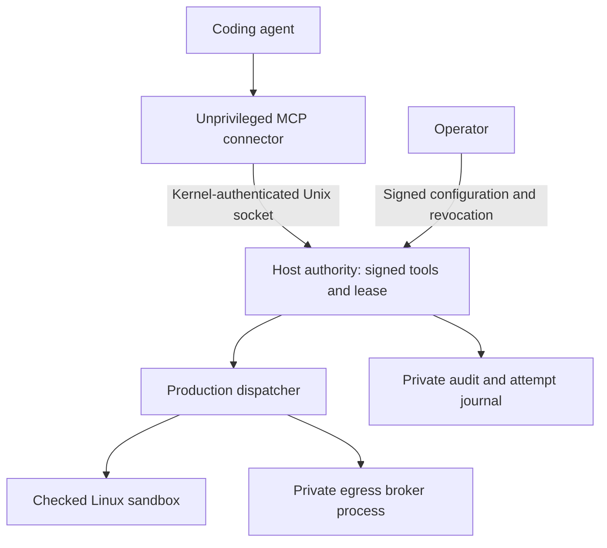

# Connecting a coding agent to BULL

BULL now has a local MCP connector backed by a separate authority service. The
operator signs a small menu of fixed tools. The agent can select a tool; it
cannot choose a new command, destination, permission, account or approval key.
Every supported effect enters `ProductionEffectRouter` and
`ProductionDispatcher`.

This is a **connected-tool preview**, not an enterprise release or a contained
coding-agent session. Codex or Claude can still use their own shell, browser,
other servers and native tools unless a separately qualified launcher removes
those routes. Do not put an unrestricted agent in the authority account or use
this connector as evidence that the whole computer is protected.

## The boundary



The model protocol carries requests, not authority. MCP is the compatibility
interface; Linux identity, signed policy and production checks enforce this
boundary. The connector has no administrative tools or signing credentials.

| Control | Implemented behavior |
|---|---|
| Tool selection | Signed names, descriptions, exact argv and executable digest, or fixed HTTPS GET/HEAD URL |
| Arguments | Empty object only; extra authority, command or payload fields are rejected |
| Visibility | `tools/list` contains implemented tools within the signed deployment ceiling |
| Identity | Dedicated agent UID verified by the kernel; the connector verifies the authority UID |
| Session | Tenant, project, session, UID, absolute expiry and total call budget are signed together |
| Revocation | Checked on list and call, then again before dispatch; already admitted work may finish |
| Broker | Actual authenticated Unix transport; capability ceiling, policy ALLOW and domain host permission still apply |
| External effects | No POST, arbitrary headers, request bodies, secret export, publish or messaging tools |
| Approval | Existing production approval checks remain in force; this connector cannot submit proofs or approve itself |
| Failure | Attempt recorded before dispatch; uncertain outcomes block later calls; no transport retries |
| Output | Bounded and explicitly labelled untrusted; network headers and raw internal errors are not exported |
| Parsing | Request size, structure and time limits; duplicate keys, non-finite numbers and extra fields rejected |
| Restart | Used leases cannot silently resume with cleared behavioral history; operator issues a new lease/state after review |

The initial maximum lease is 24 hours. A single service serializes operations.
This bounds concurrency; it is not a throughput or availability commitment.
Transport cancellation is not an immediate process kill: a started operation
can continue up to its production limits and its outcome remains in the audit.

## Install and check the code

Use this integration branch in a clean checkout:

```bash
git fetch origin feat/enterprise-agent-gateway-20260927
git worktree add --detach ../BULL-agent-gateway origin/feat/enterprise-agent-gateway-20260927
cd ../BULL-agent-gateway
python3 -m venv /tmp/bull-agent-gateway-venv
/tmp/bull-agent-gateway-venv/bin/python -m pip install -e '.[test,mcp]'
/tmp/bull-agent-gateway-venv/bin/python -m pytest -q tests/test_agent_gateway.py tests/test_gateway_broker_boundary.py tests/test_gateway_transport.py tests/test_mcp_gateway_sdk.py tests/test_production_router.py
/tmp/bull-agent-gateway-venv/bin/bull gateway coverage
```

These source tests do not configure a secure host. Socket tests explicitly skip
when the environment prevents Unix IPC; a skip cannot qualify the connection.
The MCP extra pins SDK 2.2.0. Its complete transitive dependency lock and signed
artifact pipeline are still release gates. Existing BULL installations without
the extra do not import the SDK or acquire a listener.

## Provision the local service

Use two **non-root OS accounts**: an authority account holding deployment state,
and an unprivileged agent account. The agent account must have no sudo, Docker,
administrator or equivalent route to the authority. Do not reuse that agent UID
for another tenant or concurrent lease. A UID authenticates an OS account, not
a particular model or executable. Other programs under that UID share its
grants. Multi-tenant isolation needs separate qualified deployments.

Provision these directories through your normal Linux administration:

- Authority deployment state and session journal: owned by authority, mode 0700,
  outside the project. The project must be readable by authority.
- Connector endpoint directory: owned by authority, group permitting the agent
  to traverse, mode 0710. The socket becomes mode 0660; the UID check remains
  mandatory. The parent must not be group-writable.
- Egress broker socket, if used: a separate authority-only directory, mode 0700.
- Installed BULL code and approved executables: outside the agent's write access.
  Review fixed interpreter scripts and repository contents as untrusted data.

The authority account also needs a verified production deployment: signed
runtime manifest and policy, authenticated audit transport, delegated cgroup,
strict sandbox protections and the other existing production gates. Follow
[deployment setup](REPRODUCIBLE_DEPLOYMENT.md). This feature does not turn off a
failed gate to get a service running.

Create a reviewed registry as the authority account. This example authorizes
only `/usr/bin/true`, a harmless installation check. Substitute the actual
dedicated agent UID; the example does not create or grant accounts:

```bash
AGENT_ACCOUNT_UID=$(id -u bull-agent)
python3 - "$AGENT_ACCOUNT_UID" > /tmp/bull-reviewed-registry.json <<'PY'
import hashlib, json, secrets, sys, time
from pathlib import Path
binary = Path('/usr/bin/true').resolve(strict=True)
print(json.dumps({
    'format': 'bull-agent-gateway-v1',
    'tenant_id': 'local', 'project_id': 'reviewed-project',
    'session_id': secrets.token_hex(16),
    'agent_uid': int(sys.argv[1]),
    'expires_at': int(time.time()) + 3600, 'max_calls': 10,
    'tools': [{
        'name': 'installation_check',
        'description': 'Run the fixed harmless installation check',
        'operation': 'process.execute', 'argv': [str(binary)],
        'executable_sha256': hashlib.sha256(binary.read_bytes()).hexdigest(),
        'timeout': 5
    }]
}, indent=2))
PY
```

Pass `--gateway-registry /tmp/bull-reviewed-registry.json` when creating a **new**
deployment with `tools/deployment_setup.py init`. Keep the registry in trusted
operator hands until it is signed. Default project-read/process capabilities are
enough for this example; do not grant all capabilities. A network registry still
needs the separate production approval configuration. The connector deliberately
leaves consequential requests pending rather than inventing an approval.

Start the authority from the reviewed repository as its account, substituting
your provisioned paths and agent access group ID:

```bash
python3 tools/serve_agent_gateway.py \
  --deployment /var/lib/bull-authority/deployment \
  --state /var/lib/bull-authority/lease-1 \
  --socket /run/bull-authority/agent.sock \
  --agent-gid "$(id -g bull-agent)"
```

The journal directory must exist and be empty for a new lease. Existing used
state is not silently erased. If fixed network tools are configured, start a
separate `tools/serve_agent_gateway.py --broker --deployment ... --socket ...`
process under authority in a private socket directory, and supply that path as
`--egress-socket` to the service. Do not put this broker socket in the connector's
group-accessible directory.

## Point a client at the connector

Install BULL's MCP extra in the agent environment. Use an absolute installed
`bull-mcp` path. Do **not** put `serve_agent_gateway.py`, deployment keys or a
`BULL_*` authority environment in a client configuration. The connector refuses
root, the authority UID and inherited `BULL_*` environment variables.

The client commands, run as the agent account, have this shape:

```bash
codex mcp add bull -- /absolute/agent-venv/bin/bull-mcp --socket /run/bull-authority/agent.sock --server-uid AUTHORITY_UID
claude mcp add --transport stdio bull -- /absolute/agent-venv/bin/bull-mcp --socket /run/bull-authority/agent.sock --server-uid AUTHORITY_UID
```

Replace `AUTHORITY_UID` with its numeric UID. This registers BULL's tools. It does
not disable the client's other permissions. Installed client versions must pass
their own compatibility and native-bypass qualification before managed support
can be claimed.

The `bull gateway client-config` command prints the corresponding configuration
data for review without changing client settings. `bull gateway check` checks the
real authority connection without executing a tool.

## Record a real connection test

Run as the enrolled agent account, from this clean source revision:

```bash
python3 tools/qualify_agent_gateway.py \
  --socket /run/bull-authority/agent.sock --server-uid AUTHORITY_UID \
  --bridge /absolute/agent-venv/bin/bull-mcp \
  --tool installation_check \
  --output /tmp/bull-connected-tool-report.json
```

This deliberately executes the selected fixed tool once. It checks the actual
SDK handshake, tool listing, production result and rejected spoofed arguments
over the real authority connection. The private report contains a result hash,
not the tool's output. Success is labelled `CONNECTED TOOL PASS`, with
`enterprise_qualified: false`.

To stop future admissions, run `bull gateway revoke --state ...` as authority.
Review the audit before repeating any request with an uncertain outcome. Do not
delete state or remove `REVOKED` to make a failed qualification turn green.

## What still blocks an enterprise release

`bull gateway coverage` reads the shipped gate inventory. Whole-agent containment,
native client bypass tests, long-running recovery, live multi-tenant separation,
hardware approval through this connector, signed release packaging, full
refinement tracing, independent review and enterprise identity/operations remain
open. HTTP/OAuth access is disabled. Existing KVM candidate results remain
separate evidence and are not reused as proof of this connector.

An administrator, kernel or hypervisor compromise is outside the present trust
boundary. Fixed tools and output labels do not establish immunity to prompt
injection. The security goal is to keep untrusted content from creating new
authority, then test that boundary in the deployment where it will be used.

## Review and implementation files

| File | Responsibility |
|---|---|
| `agent_tool_registry.py` | Validate the signed catalog and supported operations |
| `agent_session.py` | Lease, lock, call budget and uncertain outcomes |
| `agent_gateway.py` | Host domain creation, authorization and effect dispatch |
| `gateway_transport.py`, `gateway_wire.py` | Kernel identity and bounded IPC messages |
| `mcp_gateway.py` | MCP SDK handlers and bounded stdio transport |
| `gateway_cli.py` | Explicit operator commands and coverage reporting |
| `tools/serve_agent_gateway.py` | Load a private existing deployment |
| `tools/qualify_agent_gateway.py` | Live connected-tool test, separately scoped |

The architecture and full acceptance inventory are in
[the enterprise gateway plan](ENTERPRISE_AGENT_GATEWAY_PLAN.md). Protocol and
client references: [MCP specification](https://modelcontextprotocol.io/specification/2026-07-28),
[official Python SDK](https://github.com/modelcontextprotocol/python-sdk),
[Codex MCP](https://learn.chatgpt.com/docs/extend/mcp?surface=cli),
[Claude Code MCP](https://code.claude.com/docs/en/mcp).
