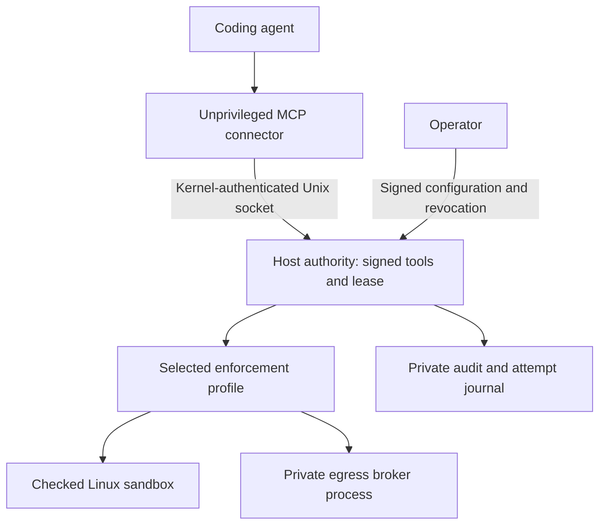

# Connecting a coding agent to BULL

BULL now has a local MCP connector backed by a separate authority service. The
operator signs a small menu of fixed tools. The agent can select a tool; it
cannot choose a new command, destination, permission, account or approval key.
The local profile routes fixed process tools through `LocalEffectRouter` and
`LocalDispatcher`. The external-audit profile uses `ProductionEffectRouter` and
`ProductionDispatcher`. Both share exact command binding and the same execution
safeguards; their audit evidence is different.

This is a **connected-tool preview**, not an enterprise release or a contained
coding-agent session. Codex or Claude can still use their own shell, browser,
other servers and native tools unless a separately qualified launcher removes
those routes. Do not put an unrestricted agent in the authority account or use
this connector as evidence that the whole computer is protected.

## The boundary



The model protocol carries requests, not authority. MCP is the compatibility
interface; Linux identity, signed policy and production checks enforce this
boundary. The connector has no administrative tools or signing credentials.

| Control | Implemented behavior |
|---|---|
| Tool selection | Signed names, descriptions, exact argv and executable digest, or fixed HTTPS GET/HEAD URL |
| Arguments | Empty object only; extra authority, command or payload fields are rejected |
| Visibility | `tools/list` contains implemented tools within the signed deployment ceiling |
| Identity | Dedicated agent UID verified by the kernel; the connector verifies the authority UID |
| Session | Tenant, project, session, UID, absolute expiry and total call budget are signed together |
| Revocation | Checked on list and call, then again before dispatch; already admitted work may finish |
| Broker | Actual authenticated Unix transport; capability ceiling, policy ALLOW and domain host permission still apply |
| External effects | No POST, arbitrary headers, request bodies, secret export, publish or messaging tools |
| Approval | Existing production approval checks remain in force; this connector cannot submit proofs or approve itself |
| Failure | Attempt recorded before dispatch; uncertain outcomes block later calls; no transport retries |
| Output | Bounded and explicitly labelled untrusted; network headers and raw internal errors are not exported |
| Parsing | Request size, structure and time limits; duplicate keys, non-finite numbers and extra fields rejected |
| Restart | Used leases cannot silently resume with cleared behavioral history; operator issues a new lease/state after review |

The initial maximum lease is 24 hours. A single service serializes operations.
This bounds concurrency; it is not a throughput or availability commitment.
Transport cancellation is not an immediate process kill: a started operation
can continue up to its production limits and its outcome remains in the audit.

## Install and check the code

**No founder key, Cloudflare account or hosted BULL service is needed for local
use.** Each local installation creates its own private signing and audit keys.
The key previously requested by the production runner authenticates receipts
from an external audit collector. It is not a Git push or software license key.

On a supported Linux host, from a clean checkout of this gateway branch:

```bash
python3 tools/run_local_agent_gateway.py --install-deps
```

This is a bounded installation check, not a persistent agent session. It creates
a temporary locked agent account, signs one fixed `/usr/bin/true` tool, runs an
actual MCP exchange and verifies the local authenticated audit against the
observed command/result. It removes its temporary service and account afterward.
Keep the printed evidence directory; share only `report.json`.

Sudo is needed for the temporary account and delegated cgroup. Linux namespaces,
strict seccomp, dynamic sandbox checks, workspace limits and real malware scanning
remain required. `--install-deps` installs OS packages; ClamAV needs usable official
databases. Missing host protections or databases remain an explicit failure.
Use `--preflight` for read-only host checks before provisioning.

| Profile | Audit evidence | Credentials | Passing live result |
|---|---|---|---|
| Local | Hash chain with authenticated checkpoint on your machine | Generated privately for this installation | `LOCAL TOOL PASS` |
| External | Authenticated receipts from your separately configured HTTPS collector | Your collector's matching key | `CONNECTED TOOL PASS` |

Local auditing detects changed records, missing checkpoints and a log that no
longer matches its authenticated checkpoint. It cannot establish off-machine
retention or resist a trusted host administrator replacing both log and key.
The separate agent account cannot read the key or alter the authority's state.
Local mode exposes no network or secret broker. It never silently replaces a
failed external-audit run, and neither result qualifies an enterprise release.

Use this integration branch in a clean checkout:

```bash
git fetch origin feat/enterprise-agent-gateway-20260927
git worktree add --detach ../BULL-agent-gateway origin/feat/enterprise-agent-gateway-20260927
cd ../BULL-agent-gateway
python3 -m venv /tmp/bull-agent-gateway-venv
/tmp/bull-agent-gateway-venv/bin/python -m pip install -e '.[test,mcp]'
/tmp/bull-agent-gateway-venv/bin/python -m pytest -q tests/test_agent_gateway.py tests/test_gateway_broker_boundary.py tests/test_gateway_transport.py tests/test_mcp_gateway_sdk.py tests/test_production_router.py
/tmp/bull-agent-gateway-venv/bin/bull gateway coverage
```

These source tests do not configure a secure host. Socket tests explicitly skip
when the environment prevents Unix IPC; a skip cannot qualify the connection.
The MCP extra pins SDK 2.2.0. Its complete transitive dependency lock and signed
artifact pipeline are still release gates. Existing BULL installations without
the extra do not import the SDK or acquire a listener.

## Provision the local service

Use two **non-root OS accounts**: an authority account holding deployment state,
and an unprivileged agent account. The agent account must have no sudo, Docker,
administrator or equivalent route to the authority. Do not reuse that agent UID
for another tenant or concurrent lease. A UID authenticates an OS account, not
a particular model or executable. Other programs under that UID share its
grants. Multi-tenant isolation needs separate qualified deployments.

Provision these directories through your normal Linux administration:

- Authority deployment state and session journal: owned by authority, mode 0700,
  outside the project. The project must be readable by authority.
- Connector endpoint directory: owned by authority, group permitting the agent
  to traverse, mode 0710. The socket becomes mode 0660; the UID check remains
  mandatory. The parent must not be group-writable.
- Egress broker socket, if used: a separate authority-only directory, mode 0700.
- Installed BULL code and approved executables: outside the agent's write access.
  Review fixed interpreter scripts and repository contents as untrusted data.

The authority account also needs a verified deployment: signed runtime manifest
and policy, authenticated local checkpoint or external audit transport, delegated
cgroup, and strict sandbox protections. The local profile retains all execution
checks and requires its own authenticated checkpoint. Follow
[deployment setup](REPRODUCIBLE_DEPLOYMENT.md). This feature does not turn off a
failed gate to get a service running.

Create a reviewed registry as the authority account. This example authorizes
only `/usr/bin/true`, a harmless installation check. Substitute the actual
dedicated agent UID; the example does not create or grant accounts:

```bash
AGENT_ACCOUNT_UID=$(id -u bull-agent)
python3 - "$AGENT_ACCOUNT_UID" > /tmp/bull-reviewed-registry.json <<'PY'
import hashlib, json, secrets, sys, time
from pathlib import Path
binary = Path('/usr/bin/true').resolve(strict=True)
print(json.dumps({
    'format': 'bull-agent-gateway-v1',
    'tenant_id': 'local', 'project_id': 'reviewed-project',
    'session_id': secrets.token_hex(16),
    'agent_uid': int(sys.argv[1]),
    'expires_at': int(time.time()) + 3600, 'max_calls': 10,
    'tools': [{
        'name': 'installation_check',
        'description': 'Run the fixed harmless installation check',
        'operation': 'process.execute', 'argv': [str(binary)],
        'executable_sha256': hashlib.sha256(binary.read_bytes()).hexdigest(),
        'timeout': 5
    }]
}, indent=2))
PY
```

Pass `--gateway-registry /tmp/bull-reviewed-registry.json` when creating a **new**
deployment with `tools/deployment_setup.py init`. Keep the registry in trusted
operator hands until it is signed. Default project-read/process capabilities are
enough for this example; do not grant all capabilities. A network registry still
needs the separate production approval configuration. The connector deliberately
leaves consequential requests pending rather than inventing an approval.

For a local installation, include `--audit-mode local` in the init command:

```bash
python3 tools/deployment_setup.py init --audit-mode local \
  --state /var/lib/bull-authority/deployment \
  --project-root /YOUR/REVIEWED/PROJECT \
  --cgroup-parent /YOUR/DELEGATED/CGROUP \
  --gateway-registry /tmp/bull-reviewed-registry.json
```

The authority must own the parent directory. This creates private local keys and
the initial authenticated checkpoint; no credential is requested from a server.
`serve_agent_gateway.py` reads the chosen profile from that deployment. Existing
external-audit deployments remain external; migrating modes requires new state.

Start the authority from the reviewed repository as its account, substituting
your provisioned paths and agent access group ID:

```bash
python3 tools/serve_agent_gateway.py \
  --deployment /var/lib/bull-authority/deployment \
  --state /var/lib/bull-authority/lease-1 \
  --socket /run/bull-authority/agent.sock \
  --agent-gid "$(id -g bull-agent)"
```

The journal directory must exist and be empty for a new lease. Existing used
state is not silently erased. If fixed network tools are configured, start a
separate `tools/serve_agent_gateway.py --broker --deployment ... --socket ...`
process under authority in a private socket directory, and supply that path as
`--egress-socket` to the service. Do not put this broker socket in the connector's
group-accessible directory.

## Point a client at the connector

Install BULL's MCP extra in the agent environment. Use an absolute installed
`bull-mcp` path. Do **not** put `serve_agent_gateway.py`, deployment keys or a
`BULL_*` authority environment in a client configuration. The connector refuses
root, the authority UID and inherited `BULL_*` environment variables.

The client commands, run as the agent account, have this shape:

```bash
codex mcp add bull -- /absolute/agent-venv/bin/bull-mcp --socket /run/bull-authority/agent.sock --server-uid AUTHORITY_UID
claude mcp add --transport stdio bull -- /absolute/agent-venv/bin/bull-mcp --socket /run/bull-authority/agent.sock --server-uid AUTHORITY_UID
```

Replace `AUTHORITY_UID` with its numeric UID. This registers BULL's tools. It does
not disable the client's other permissions. Installed client versions must pass
their own compatibility and native-bypass qualification before managed support
can be claimed.

The `bull gateway client-config` command prints the corresponding configuration
data for review without changing client settings. `bull gateway check` checks the
real authority connection without executing a tool.

## Record an external-audit connection test

The local command above is the first-run path. The commands in this section are
for operators who deliberately require independently retained audit receipts.

For a one-shot Codespaces test of the actual production path, run as the normal
operator from a clean checkout:

```bash
python3 tools/run_codespace_agent_gateway.py --install-deps
```

The runner looks for exactly one existing BULL deployment with a configured
external HTTPS collector under `~/.local/share/bull` or the older
`~/.local/share/bull-production`. If there are none or several, select one explicitly:

```bash
python3 tools/run_codespace_agent_gateway.py --deployment /PRIVATE/BULL/STATE
```

An operator with an already deployed collector can instead supply
`--collector-url https://YOUR-COLLECTOR/v1/checkpoints --collector-key-file /PRIVATE/key`.
The key must be an operator-owned private file; never paste its contents. The
runner does not create or change a Cloudflare deployment. Local test collectors,
test CAs, absent credentials and failed Linux protection checks stay blocked.
`--preflight` performs read-only prerequisite and collector-selection checks.

For the environment-secret workflow in the earlier Codespaces deployment guide,
select those inputs explicitly:

```bash
python3 tools/run_codespace_agent_gateway.py --collector-from-env --install-deps
```

This requires `BULL_REMOTE_AUDIT_ANCHOR_URL` and the existing matching
`BULL_REMOTE_AUDIT_ANCHOR_KEY` (also accepted as `BULL_ANCHOR_MASTER_KEY`),
or a private file selected through `BULL_DEPLOYMENT_ANCHOR_KEY_FILE`.
If multiple key inputs are supplied, their bytes must match. The runner preserves
the exact bytes in a new mode-0600
file inside its private directory and clears the injected key from the process
environment before setup. It never changes the collector's key or configuration.
`--preflight --collector-from-env` validates availability without creating files
or contacting the collector.

Reports show only whether the named environment inputs are present and candidate
file paths in the two BULL state directories. They do not print secret values,
search unrelated home directories, or read key bytes just to list paths. No
candidate or available environment secret means the existing collector credential
must be restored in this Codespace before a live production run. Disposable KVM
test keys do not authenticate to that collector. The signed collector receipt
is still required for a passing result; finding configuration is not authentication.

The live command installs a separate Python environment, creates a fresh signed
deployment, and invokes the checked-in sudo helper. The helper delegates the
operator's BULL cgroup and creates a temporary locked `bull-gw-*` account. The
operator is the non-root authority; the temporary account gets only the agent
socket group and runs with `no_new_privs`. It must be unable to read authority
keys, modify the source/environment or access the Docker control socket.
Only `/usr/bin/true` (resolved and hash-bound) is authorized. A harmless input
file also exercises the real malware-admission path. Existing ClamAV databases
must be usable. No Codex/Claude session is started and no KVM image is rebuilt.

The test performs a real SDK exchange, rejects a spoofed command without an
admission, and requires the exact expected argv, execution and exit zero. It
then checks that one admission and one matching audit result exist and verifies
the collector acknowledgement's MAC, session, sequence and ledger head. The
helper stops its own processes and removes its temporary account/group. Cleanup
errors prevent a passing result. It changes no host firewall and exposes no TCP
service. The run directory retains logs and disposable keys in private files
and directories; share only its redacted `report.json`. Success remains
`CONNECTED TOOL PASS`, not enterprise qualification or native-agent containment.

For an authority that is already running, use the smaller client-only probe below.
Run as the enrolled agent account, from this clean source revision:

```bash
python3 tools/qualify_agent_gateway.py \
  --socket /run/bull-authority/agent.sock --server-uid AUTHORITY_UID \
  --bridge /absolute/agent-venv/bin/bull-mcp \
  --tool installation_check \
  --output /tmp/bull-connected-tool-report.json
```

This deliberately executes the selected fixed tool once. It checks the actual
SDK handshake, tool listing, production result and rejected spoofed arguments
over the real authority connection. The private report contains a result hash,
not the tool's output. Success is labelled `CONNECTED TOOL PASS`, with
`enterprise_qualified: false`.

When probing an already running local-audit authority, add `--audit-mode local`.
The probe checks the authority's reported profile before executing and labels
success `LOCAL TOOL PASS`. It rejects a profile mismatch.

To stop future admissions, run `bull gateway revoke --state ...` as authority.
Review the audit before repeating any request with an uncertain outcome. Do not
delete state or remove `REVOKED` to make a failed qualification turn green.

## What still blocks an enterprise release

`bull gateway coverage` reads the shipped gate inventory. Whole-agent containment,
native client bypass tests, long-running recovery, live multi-tenant separation,
hardware approval through this connector, signed release packaging, full
refinement tracing, independent review and enterprise identity/operations remain
open. HTTP/OAuth access is disabled. Existing KVM candidate results remain
separate evidence and are not reused as proof of this connector.

An administrator, kernel or hypervisor compromise is outside the present trust
boundary. Fixed tools and output labels do not establish immunity to prompt
injection. The security goal is to keep untrusted content from creating new
authority, then test that boundary in the deployment where it will be used.

## Review and implementation files

| File | Responsibility |
|---|---|
| `agent_tool_registry.py` | Validate the signed catalog and supported operations |
| `agent_session.py` | Lease, lock, call budget and uncertain outcomes |
| `agent_gateway.py` | Host domain creation, authorization and effect dispatch |
| `gateway_transport.py`, `gateway_wire.py` | Kernel identity and bounded IPC messages |
| `mcp_gateway.py` | MCP SDK handlers and bounded stdio transport |
| `gateway_cli.py` | Explicit operator commands and coverage reporting |
| `tools/serve_agent_gateway.py` | Load a private existing deployment |
| `tools/qualify_agent_gateway.py` | Live connected-tool test, separately scoped |

The architecture and full acceptance inventory are in
[the enterprise gateway plan](ENTERPRISE_AGENT_GATEWAY_PLAN.md). Protocol and
client references: [MCP specification](https://modelcontextprotocol.io/specification/2026-07-28),
[official Python SDK](https://github.com/modelcontextprotocol/python-sdk),
[Codex MCP](https://learn.chatgpt.com/docs/extend/mcp?surface=cli),
[Claude Code MCP](https://code.claude.com/docs/en/mcp).
