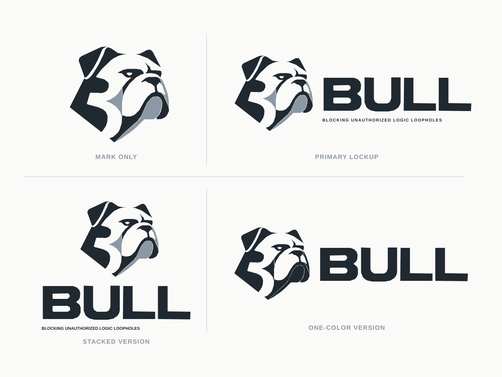

# BULL brand assets

BULL means **Blocking Unauthorized Logic Loopholes**. The bulldog is the shared identity for the project, website and documentation—not a public logo-gallery section.

## Approved identity sheet

The approved B-shaped bulldog presentation board is preserved as a self-contained vector at [`site/assets/brand/bull-brand-board.svg`](../site/assets/brand/bull-brand-board.svg).

## Source of truth

Use the SVGs in [`site/assets/brand/`](../site/assets/brand/) for the website, README and documentation. They were retraced from the owner-approved raster sheet so the public site can keep scalable, self-contained assets without embedding font files or external images.

| Asset | Use |
|---|---|
| `bull-mark.svg` | Small project marks and footer |
| `bull-primary.svg` | Website header and light-background README |
| `bull-primary-dark.svg` | Dark-background README |
| `bull-stacked.svg` | Square and vertical formats |
| `bull-one-color.svg` | One-color reproduction |
| `bull-favicon.svg` | Browser tab |
| `bull-brand-board.svg` | Full approved identity presentation board |

Preserve proportions and a clear margin. Do not add horns, shields, neon effects or unrelated symbols. Use the mark alone when the descriptor would be unreadable. The core palette is charcoal, silver, white and warm off-white.

The public website is an engineering publication with an embedded narrated architecture film. It does not display a logo-download gallery or a visitor testing console. Source variants stay available in this directory for maintainers. Images, kernels, deployment credentials and real deployment configurations belong outside the checkout; the local-only VM asset protections remain unchanged.

## Naming and technical claims

Use BULL consistently. Tie implementation statements to source. Distinguish architectural illustrations from live execution, host regression tests from real-KVM boot evidence, and bounded formal models from implementation-wide proofs. Do not imply an independent audit or a finished persistent MicroVM release.
