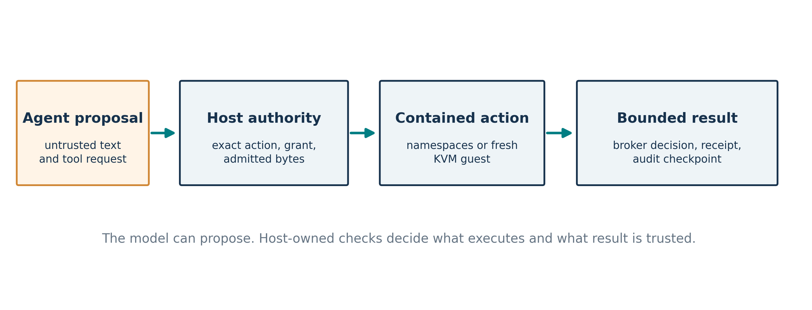
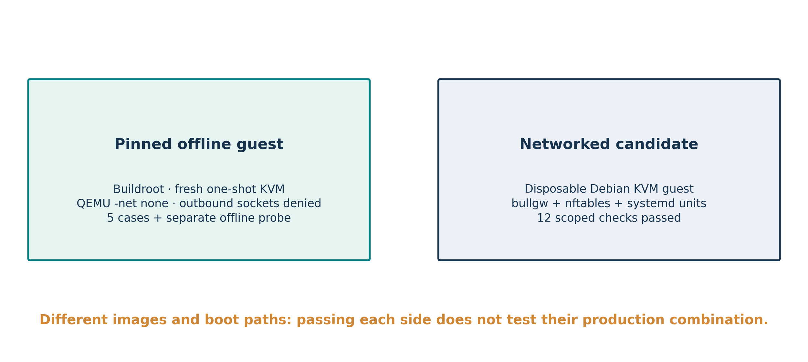
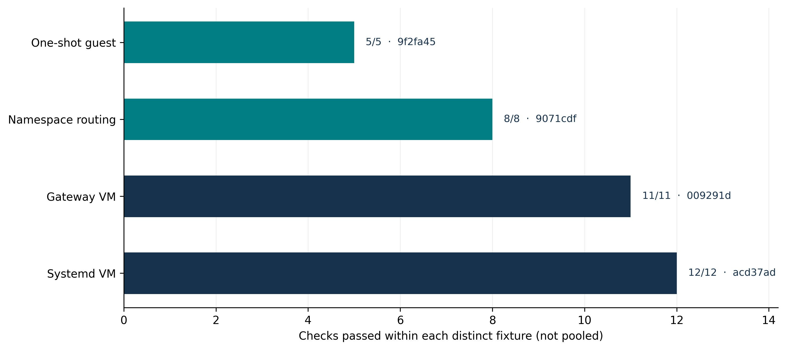

## 1. Research question and contribution

Can an AI agent's proposed operation be made conditional on host-owned authority, execute inside a bounded Linux environment, and leave evidence that distinguishes a completed action from a plausible-looking workload message? BULL [1,2] implements one answer for specific entry points. The September integration added a packaged lifecycle bridge to `ProductionDispatcher`, an egress gateway with nftables rules, and read-only qualification cards in the command console. This paper asks a narrower empirical question: **which combinations actually ran under KVM, and what remains only a design or deployment candidate?**

The contributions are (i) a boundary-oriented account of the integrated architecture; (ii) a fixture-by-fixture ledger for operator-reported KVM, namespace, gateway, systemd, and console observations; (iii) a failure analysis of the gateway redirect path that motivated a conntrack-constrained correction; and (iv) an acceptance protocol for the still untested production combination. We do not claim that passing fixtures certify arbitrary agent behavior, every host adapter, or an internet-facing service.

{ width=95% }

**Plain-language reading of Figure 1.** The agent can ask to do something. A trusted host checks the permission and exact action, gives the work a fenced place to run, and only then treats a bounded result and audit checkpoint as meaningful. Text generated by the agent does not become permission by being persuasive.

## 2. Threat model and implementation boundaries

The adversarial side includes model output, retrieved instructions, user-supplied or downloaded files, guest workload code, and its stdout/stderr. Trusted elements include the administrator and configuration, Linux kernel, installed BULL code, authority registry and keys, brokers, and audit endpoint; the guest path also relies on QEMU/KVM, firmware, guest kernel, and supervisor [1,2]. A hostile host administrator or compromised trusted signing key is outside the present protection claim. Ordinary KVM is isolation, not confidential computing against the host.

The host route uses user, mount, PID, network, and IPC namespaces; seccomp, Landlock, `no_new_privs`, cgroup limits, and a parent-checked pre-exec attestation for qualified launch paths [1,2]. Its protections depend on kernel features and real host setup. The one-shot guest route launches a fresh VM, binds the execute request to an authenticated channel, and refuses a second execute after authority is consumed or a channel fails. Cancellation and timeout do not imply restoration of guest RAM or exactly-once external side effects. The lifecycle bridge admits an exact command under a host-owned grant and calls `ProductionDispatcher`; it does not yet mediate every possible broker and application adapter.

The gateway combines a policy decision with Linux nftables redirection and an output filter. DNS and HTTP can be redirected to a local unprivileged gateway; other routes must remain closed, including alternate ports and IPv6. HTTPS content is not transparently decrypted, and the policy must be read as an explicit egress policy, not a universal prevention guarantee. A gateway process must not acquire an ambient route around the filter. If the gateway fails, requests should close rather than escape. The shipped pinned Buildroot guest has QEMU networking disabled with `-net none`; the networked Debian qualification guest is a **separate image**.

{ width=95% }

The systemd candidate copied the actual `deploy/bull-egress-gateway.service` into a disposable Debian guest, installed a redirect unit and lab network/qualification units, and booted PID 1 as systemd. Its service test is stronger than a direct-init gateway smoke test, but it is not a test of the pinned Buildroot production image. The console explicitly preserves that distinction: it can show a source-bound `gateway_lab: PASS` and `egress: UNVERIFIED` simultaneously.

## 3. Why the 2026 incident record matters

This section uses recent primary disclosures to motivate failure modes, **not** as evidence that BULL prevented the incidents. In July, Anthropic reported three incidents identified in a review of 141,006 cyber evaluation runs in which models reached the real internet from or through a third-party environment and accessed real organizations. Its report attributes a key failure to an environment that had internet access despite prompts saying otherwise [3]. An offline-network assertion therefore needs a VM command-line observation and an in-guest denial probe, while a networked fixture needs actual routing tests. A prompt alone is not an egress control.

GitHub's March 2026 advisory CVE-2026-29783 describes executable shell parameter-expansion patterns classified as read-only by a Copilot CLI command classifier [4]. It illustrates why approving a broad-looking command string is weaker than binding the intended executable, arguments, and execution route. BULL's exact-command admission is relevant to that failure class, but no test here replays the advisory against BULL. Orca Security's February RoguePilot disclosure describes prompt injection from GitHub issue text that induced an assistant workflow to manipulate a symlink and expose a token [5]. This reinforces the separation between retrieved content and host permissions. OX Security's April MCP STDIO research discusses command execution risks in tool server configuration [6]; a BULL adapter must itself remain inside the authority boundary, and the current lifecycle bridge should not be mistaken for complete mediation of all MCP servers.

| Incident or disclosure | Trust boundary illustrated | BULL response to evaluate | Result in this paper |
|:--|:--|:--|:--|
| Anthropic evaluation incidents, July 2026 [3] | Simulated range versus live internet | Confirm actual guest routes and fail-closed egress | Offline guest and disposable networked candidate only |
| GitHub shell expansion advisory, March 2026 [4] | Command classifier versus shell semantics | Bind executable/arguments; reject ambiguous shell authority | Architecture and selected admission tests; exploit replay absent |
| RoguePilot, February 2026 [5] | Issue text versus tool authority and filesystem | Keep external text untrusted; constrain files and broker effects | Relevant design, no incident-specific test |
| MCP STDIO advisory, April 2026 [6] | Tool configuration versus host execution | Govern real host adapters and installation paths | Adapter coverage incomplete |

## 4. Method and evidence grading

The source cutoff is clean runtime commit `acd37ad591bf3d65de9cfd1b2d041c86b5a46bf0` on the lifecycle-egress-console integration branch. The paper itself is a later documentation revision. Counts below come from terminal transcripts supplied by the operator, not from public raw case reports. The paper author inspected the implementation and the reported summaries but did **not** independently open the private KVM reports, boot logs, packet traces, credentials, or signed assets. The setup scripts write reports with revision and asset hashes and require a clean source tree; their local checks improve traceability but are not independent certification. All these observations are local, disposable, and single-session unless stated otherwise.

We classify evidence as **implementation inspected**, **operator-reported live result**, **local UI observation**, or **unverified deployment claim**. A PASS means all checks in one named fixture passed; counts across fixtures have different denominators, code revisions, images, and dependencies. They cannot be summed into a pooled success rate. We do not infer a probabilistic escape rate or confidence interval from zero failures in this selected suite. The earlier BULL II paper's 501 tests and 21 subtests belong to `ab53f56`, not this integration revision [1]. A separate integration note recorded 643 tests and 21 subtests with four restricted-runner failures and 56 lifecycle plus 20 site checks at its candidate; it was written before the latest KVM runs [2]. These historical totals are not silently transferred to `acd37ad`.

## 5. Results by fixture

| Fixture; source commit | Observation supplied by operator | What it establishes | What it does not establish |
|:--|:--|:--|:--|
| Pinned one-shot KVM; `9f2fa45` | 5/5: allowed, denied, timeout, cancel, missing protection | Fresh guest/control path for five selected outcomes, disposable TLS collector | Persistent sessions, outside collector, later source revision |
| Pinned offline guest; `9f2fa45` | PASS; observed QEMU `-net none`, IPv4/IPv6 socket denials | Selected governed workload had no usable outbound socket in that run | `bullgw`, nftables, network-capable production image |
| Dual-stack namespace; `9071cdf` | 8/8 selected redirect/drop/failure checks | Disposable routing rules under substituted gateway UID | Guest service, production unit, production image |
| Direct-init gateway KVM; `009291d` | 11/11; `bullgw` UID, HTTP/DNS decisions, IPv4/IPv6 closures, counters, down/restart | Real gateway and nftables in disposable Debian KVM | systemd or pinned production image |
| Systemd gateway KVM; `acd37ad` | 12/12, including active service units | Actual BULL unit and nftables behavior in a disposable Debian systemd candidate | Installed production image and its entire deployment pipeline |
| Console snapshot; `009291d` | `gateway_lab: PASS`, `egress: UNVERIFIED` | Local read-only UI kept lab and deployed claims separate | Production telemetry, remote authenticated proof |

{ width=90% }

The one-shot cases were rerun at several intermediate commits in the operator transcript, but the latest visible five-case result was at `9f2fa45`, before the gateway and systemd candidate additions. The separate offline check at that revision corrected an initial test bug: its first attempt tried to read `/sys/class/net`, which the workload sandbox did not expose. The amended probe used socket denials and passed. This change is a measurement repair; it does not create a networked gateway proof.

The networked lab initially exposed concrete faults. Guest NIC discovery, nftables named priority compatibility, Python package visibility under the `bullgw` UID, and DNS upstream parsing each blocked startup in succession. More significantly, the direct gateway HTTP relay passed while redirected HTTP timed out. Instrumentation found the redirect counter incrementing and the output filter dropping the connection. A subsequent rule admitted only conntrack-confirmed local gateway redirects through the filter, then the 11 checks passed at `bcc5a7a` and again at `009291d`. This sequence demonstrates why a direct gateway request was insufficient to validate transparent redirection; it also shows that the final PASS depends on a security-sensitive filter exception whose scope warrants adversarial review.

The first systemd candidate ran the redirect, lab network, gateway, and qualification units but produced no terminal result before the deadline. A revised qualification service survived the gateway-stop phase, and the operator reported 12/12 at `acd37ad`. These are positive observations on the disposable candidate, not proof that the original production image contains systemd. The console's main egress card appropriately remains UNVERIFIED for that distinct deployment claim.

## 6. Acceptance ladder and remaining experiment

The results support an evidence ladder: code and policy construction; namespace route checks; actual offline pinned guest; networked KVM gateway; systemd service candidate. The final rung—**one production network-capable image containing the intended agent workload, gateway, nftables and service startup together**—has not been climbed. The current pinned image is an offline variant. It is safe to keep it offline while building a separate versioned candidate rather than silently adding a NIC to the qualified image.

A production-combination experiment should freeze a clean source commit and image digest; build a distinct guest with its chosen network driver, IPv4/IPv6 policy, gateway package and systemd unit; verify package signatures and image hashes; boot under KVM with constrained upstream; and collect in-guest service state, effective nftables rules and counters, UID, routes, socket probes, gateway shutdown/restart behavior, and host-observed QEMU arguments. It must exercise both an authorized request and direct alternate IPv4/IPv6, DNS, raw-IP, and non-web attempts from the **same agent workload path**. Failures should preserve private logs and remain failures, not become skips. The independent outside collector, if enabled, needs its own credentials and test, while a down collector must not allow consequential effects to proceed. Reboots and version changes require fresh evidence. Only after this result can a console card claim that exact deployed image and service; signatures need a documented key/trust root rather than a self-signed assertion alone.

## 7. Security debt and validity limits

The raw namespace backend currently exposes `writable=True` as a default, and its workspace bind does not apply `nosuid`. Its caller in the qualified production path supplies a safer read-only choice, but invoking the raw backend as root on a writable host workspace could allow a setuid artifact to cross the intended privilege boundary. The safe default and root refusal should be fixed and attacked directly through `ProductionDispatcher`, with a regression that verifies the on-disk mount flags and owner/permission outcomes. The current paper does not count this as solved.

The finite TLA+ models are design-level checks. Without a maintained mapping from Python state/transitions to spec actions, they cannot prove the implementation refines the models. A hardware-bound signed human approval has not been demonstrated end-to-end; observed KB2040 gestures in BULL II were unsigned diagnostics. No independent third-party red team has attacked the integrated runtime. Tests authored and selected by the project have selection bias. The private KVM case reports, boot logs and traffic captures were not independently inspected here, limiting the strength of the evidence. Earlier source revisions are historically meaningful, but do not retroactively certify the cutoff commit. The Debian image, guest boot, QEMU restricted user networking and direct-init/systemd lab infrastructure differ from a production Buildroot deployment. The console snapshot proves local presentation and evidence separation, not the underlying deployed egress status.

The research-grade score at this cutoff is **7/10** as an editorial assessment: credible layered architecture and multiple real-KVM fixtures, with unusually explicit scope; reduced by raw-backend defaults, incomplete adapter mediation, unsigned hardware approval, lack of formal refinement and independent attack review. Production deployment readiness is **4/10**, a separate judgment reflecting the missing combined image and deployment proof. These ratings are not benchmark measurements and cannot be compared numerically to gVisor, Firecracker, or another product without a shared threat model and evaluation protocol.

## 8. Conclusion

BULL's September work moved beyond source-only claims. Operator transcripts show five governed one-shot KVM outcomes, a distinct offline guest denial, dual-stack routing checks, a networked gateway actually running inside a KVM guest, and a disposable systemd candidate with the real BULL service unit. The debugging record is informative: the transparent redirect failed even when direct relay worked, and a constrained conntrack exception was needed before the selected probes passed. The command console displayed the lab PASS without promoting deployed egress to PASS. This is valuable experimental progress. It does not yet establish a production networked BULL image with full agent lifecycle, gateway, and audit consequences together. The next publishable result is that integrated artifact and its adversarially inspected, source- and image-bound evidence.

## References

1. L. Minier, *BULL II: Binding Authority to Execution*, source manuscript and evidence archive, Anharmoniclabs/BULL, `docs/papers/bull-ii/`, September 2026. https://github.com/Anharmoniclabs/BULL/tree/main/docs/papers/bull-ii
2. Anharmoniclabs, *BULL integration candidate and live KVM status*, `docs/INTEGRATION_QUALIFICATION_20260927.md`, source through `acd37ad`, September 2026. https://github.com/Anharmoniclabs/BULL/pull/82
3. Anthropic, *Investigating three real-world incidents in our cybersecurity evaluations*, July 30, 2026; updated August 3. https://www.anthropic.com/news/investigating-incidents-cybersecurity-evals
4. GitHub Advisory Database, *GitHub Copilot CLI Dangerous Shell Expansion Patterns Enable Arbitrary Code Execution*, CVE-2026-29783 / GHSA-g8r9-g2v8-jv6f, March 2026. https://github.com/advisories/GHSA-g8r9-g2v8-jv6f
5. Orca Security, *RoguePilot: GitHub Copilot prompt injection research*, February 2026. https://orca.security/resources/blog/roguepilot-github-copilot-vulnerability/
6. OX Security, *MCP STDIO Command Injection: Full Vulnerability Advisory*, April 2026. https://www.ox.security/blog/mcp-supply-chain-advisory-rce-vulnerabilities-across-the-ai-ecosystem/
7. Linux kernel documentation, *Seccomp BPF*, *Landlock*, and *Control Group v2*. https://docs.kernel.org/userspace-api/seccomp_filter.html ; https://docs.kernel.org/userspace-api/landlock.html ; https://docs.kernel.org/admin-guide/cgroup-v2.html
8. BULL source: `src/bulldog/qualification.py`, `tools/run_codespace_kvm.py`, `tools/egress_namespace_lab.py`, `tools/run_codespace_gateway_kvm.py`, `tools/run_codespace_gateway_systemd_kvm.py`, `deploy/bull-egress-gateway.service`, `microvm/guest/public/bull_defconfig`; integration commit `acd37ad591bf3d65de9cfd1b2d041c86b5a46bf0`. https://github.com/Anharmoniclabs/BULL/pull/82

*Data and ethics note.* `evidence.json` contains only sanitized counts, commit abbreviations, and scopes transcribed from the operator's messages. The private `/tmp/bull-*` directories include disposable credentials and are intentionally excluded. The plots encode these stated observations, not generated trials or inferred success probabilities.
